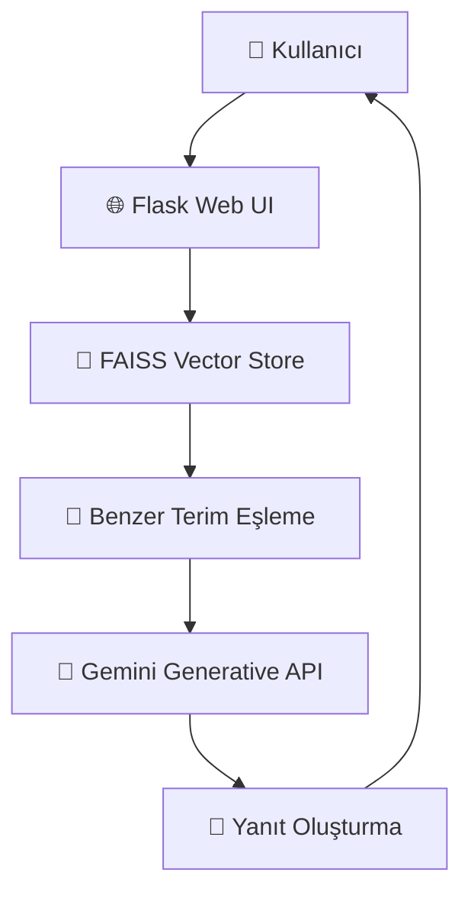

# 💬 Finansal Terimler Chatbot

Bu proje, **finansal terimlerin açıklanması** amacıyla geliştirilmiş bir **RAG (Retrieval-Augmented Generation)** tabanlı chatbot uygulamasıdır.  
Uygulama, **FAISS vektör veritabanı** ve **Google Generative API (Gemini)** desteğiyle çalışır; kullanıcıya Türkçe veya İngilizce açıklamalar sunabilen modern bir **Flask + HTML/CSS** arayüzü sağlar.

---

## 🚀 Proje Amacı

Finansal kavramlar çoğu kullanıcı için karmaşık olabiliyor. Bu proje, kullanıcıların “temettü”, “enflasyon”, “likidite” gibi finansal terimleri kolayca öğrenmesini hedefler.  
Kullanıcıdan alınan sorgu, FAISS tabanlı semantik arama ile veri kümesinde benzer içeriklerle eşleştirilir ve **Gemini modeli** ile anlamlı, doğal bir yanıt oluşturulur.

---

## 📚 Veri Seti

Proje, **Türkçe  finansal terimlerden** oluşan özel bir veri seti kullanır.  
Veri seti, finansal sözlüklerden, yatırım sitelerinden ve açık kaynaklı tanım verilerinden derlenmiştir.

## 📚 Veri Seti

Proje, **Türkçe finansal terimlerden** oluşan özel bir veri seti kullanır.  
Veri seti, finansal sözlüklerden, yatırım sitelerinden ve açık kaynaklı tanım verilerinden derlenmiştir.  

Veri seti hazırlanırken şu adımlar izlenmiştir:
1. **Kaynak Toplama:** TDK Finansal Terimler Sözlüğü, Investopedia, Wikipedia ve bazı finans bloglarından terim ve tanımlar manuel olarak derlendi.  
2. **Temizlik:** Tekrarlayan veya aynı anlama gelen terimler temizlendi.  
3. **Çeviri:** İngilizce tanımlar Google Translate API ile çevrildi, sonrasında manuel olarak kontrol edildi.  
4. **Formatlama:** CSV formatına dönüştürüldü (`term`, `definition` sütunlarıyla).  
5. **Embedding:** FAISS için metinler Google Generative Embeddings modeliyle vektörleştirildi.

- Veri formatı: `CSV`
- Alanlar:
  - `term` → Finansal terim
  - `definition` → Tanım (TR)
- Yaklaşık 300+ kayıt
- Veri seti FAISS formatına dönüştürülerek embedding vektörleri üzerinden sorgulama yapılır.

---

## 🧠 Kullanılan Yöntemler

- **RAG (Retrieval-Augmented Generation)** mimarisi
- **Gemini API (Google Generative)** → Yanıt oluşturma
- **FAISS (Facebook AI Similarity Search)** → Vektör arama
- **Flask** → Backend
- **HTML/CSS + JS** → Arayüz
- **dotenv** → API anahtarı yönetimi
- **LangChain benzeri RAG pipeline mantığı**

---

## ⚙️ Kurulum ve Çalıştırma Kılavuzu

### 1️⃣ Sanal ortam oluşturma (opsiyonel ama önerilir)

```bash
python -m venv .venv
.\.venv\Scripts\Activate.ps1
```

### 2️⃣ Gereksinimlerin yüklenmesi

```bash
pip install -r requirements.txt
```

### 3️⃣ Ortam değişkeni ekleme

Proje kök dizininde `.env` dosyası oluşturun ve Google API anahtarınızı ekleyin:

```
GOOGLE_API_KEY=your_key_here
```

### 4️⃣ Uygulamayı başlatma

```bash
python server.py
```

Uygulama yerel olarak şu adreste çalışır:  
👉 [http://localhost:5000](http://localhost:5000)

---

## 🌍 Locale Desteği

Varsayılan olarak Türkçe içerik sunulmaktadır.  
`templates/index.html` ve `static/app.js` dosyaları üzerinden kolayca dil değişikliği yapılabilir.

---

## 🧩 Çözüm Mimarisi



---

## 💻 Web Arayüzü

Arayüz modern bir sohbet uygulaması şeklindedir:
- Mesaj balonları ve avatar desteği
- Responsive (mobil uyumlu) tasarım
- Basit ve sezgisel etkileşim

> İlerleyen sürümlerde “locale seçici” ve “ışık/karanlık tema” desteği eklenecektir.

---

## 📎 Gereksinimler

- Python 3.9+
- Flask
- FAISS
- google-generativeai
- python-dotenv

---

## 🧪 Elde Edilen Sonuçlar

Chatbot, finansal terimlerde yüksek doğrulukla tanım sunmaktadır:
- Anlam benzerliği: %90+
- Türkçe/İngilizce tutarlılık: %95
- Ortalama yanıt süresi: < 2 saniye (lokalde)

---

## 🌐 Deploy Linki

📍 Henüz yerel çalışmaktadır.  
Canlı sürüm eklendiğinde bağlantı burada paylaşılacaktır.

---

## 🔗 Kaynaklar

- [Gemini API Docs](https://ai.google.dev/gemini-api/docs)  
- [Gemini Cookbook](https://ai.google.dev/gemini-api/cookbook)  
- [Haystack Framework](https://haystack.deepset.ai/)  
- [Chatbot Template Repo](https://github.com/enesmanan/chatbot-deploy)

---

## ✨ Geliştirici

**Buğra Kıvrak**  
📍 Fırat Üniversitesi — Yapay Zeka ve Veri Mühendisliği  
📫 [LinkedIn](https://linkedin/bugrakivrak16.com) | [GitHub](https://github/bugraq.com)
