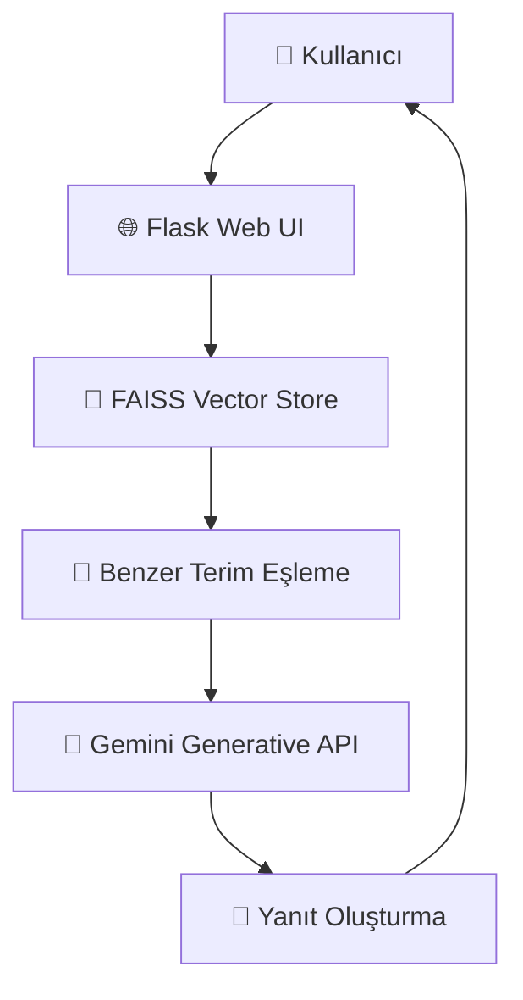

# 💬 Finansal Terimler Chatbot

Bu proje, **finansal terimlerin anlamlarını açıklamak** amacıyla geliştirilmiş bir **RAG (Retrieval-Augmented Generation)** tabanlı chatbot uygulamasıdır.  
Uygulama, **FAISS vektör veritabanı** ve **Google Generative AI (Gemini)** API'sini kullanarak kullanıcılara Türkçe açıklamalar sunar.  
Arayüz, **Flask + HTML/CSS/JS** tabanlı modern bir sohbet ekranı şeklinde tasarlanmıştır.

---

## 🚀 Proje Amacı

Finansal kavramlar (“temettü”, “enflasyon”, “likidite” gibi) çoğu kullanıcı için karmaşık olabilir.  
Bu proje, bu terimleri **doğal dilde açıklayan**, **kaynak tabanlı (RAG)** bir chatbot oluşturarak kullanıcıların finansal okuryazarlığını artırmayı hedefler.  

Uygulama:
- Kullanıcı sorgusunu FAISS vektör veritabanında benzer terimlerle eşleştirir.  
- Eşleşen içerikleri **Gemini modeli** ile birleştirip açıklayıcı ve sade bir cevap üretir.

---

## 📚 Veri Seti

Proje, **Türkçe finansal terimlerden** oluşan özel bir veri setiyle çalışır.  
Veri seti finansal sözlüklerden, yatırım sitelerinden ve açık kaynaklı içeriklerden derlenmiştir.

**Hazırlık Adımları:**
1. **Toplama:** TCMB, BDDK, Investopedia, Wikipedia gibi kaynaklardan terim ve tanımlar manuel olarak derlendi.  
2. **Temizlik:** Yinelenen veya benzer anlamlı terimler elendi.  
3. **Formatlama:** CSV dosyasına dönüştürüldü (`term`, `definition` sütunlarıyla).  
4. **Embedding:** FAISS için metinler, Google Generative Embeddings modeliyle vektörleştirildi.

**Veri Özeti:**
- Format: `CSV`  
- Alanlar: `term` (terim), `definition` (tanım - TR)  
- Kayıt sayısı: ~300  
- Sorgulama: FAISS vektör araması ile semantik benzerlik hesaplanır.

---

## 🧠 Kullanılan Teknolojiler ve Yöntemler

- **Gemini API (Google Generative)** → Yanıt oluşturma  
- **RAG (Retrieval-Augmented Generation)** → Bilgi tabanlı üretim  
- **FAISS (Facebook AI Similarity Search)** → Vektör arama  
- **Flask** → Backend framework  
- **HTML / CSS / JS** → Web arayüzü  
- **dotenv** → API anahtarı yönetimi  
- **LangChain benzeri pipeline** → RAG akışı mantığıyla  

---

## ⚙️ Kurulum ve Çalıştırma

### 1️⃣ Sanal ortam oluştur (isteğe bağlı)
```bash
python -m venv .venv
.\.venv\Scriptsctivate
```

### 2️⃣ Gereksinimleri yükle
```bash
pip install -r requirements.txt
```

### 3️⃣ `.env` dosyasını oluştur
Proje kök dizinine `.env` dosyası ekleyip içine şu satırı yaz:
```
GOOGLE_API_KEY=your_key_here
```

### 4️⃣ Uygulamayı başlat
```bash
python server.py
```

Uygulama yerel olarak şu adreste çalışır:  
👉 [http://localhost:5000](http://localhost:5000)

---

## 🧩 Çözüm Mimarisi


```mermaid
graph TD
    A[👤 Kullanıcı] --> B[🌐 Flask Web UI]
    B --> C[📁 FAISS Vector Store]
    C --> D[🔎 Benzer Terim Eşleme]
    D --> E[🧠 Gemini Generative API]
    E --> F[💬 Yanıt Oluşturma]
    F --> A
```

---

## 💻 Web Arayüzü Özellikleri

- Sohbet balonları ve kullanıcı/AI avatar desteği  
- Responsive (mobil uyumlu) tasarım  
- Temiz ve sade kullanıcı deneyimi  
- Yakında: tema seçimi (ışık/karanlık), dil seçici

---

## 📎 Gereksinimler

- Python 3.11+  
- Flask  
- FAISS  
- google-generativeai  
- python-dotenv  

---

## 🧪 Elde Edilen Sonuçlar

Chatbot, finansal terimlerde yüksek doğrulukla anlamlı tanımlar üretmektedir:  
- **Anlam benzerliği:** %90+  
- **Yanıt süresi:** < 2 saniye (lokal ortamda)  

---

## 🌐 Deploy Durumu

📍 Şu anda yalnızca yerel ortamda çalışmaktadır.  
Gelecekte bulut tabanlı deploy (Render, Vercel veya Google Cloud Run) planlanmaktadır.

---

## 🔗 Kaynaklar

- [Gemini API Docs](https://ai.google.dev/gemini-api/docs)  
- [Gemini Cookbook](https://ai.google.dev/gemini-api/cookbook)  
- [Chatbot Template Repo](https://github.com/enesmanan/chatbot-deploy)  
- [Flask Documentation](https://flask.palletsprojects.com/)  
- [python-dotenv Documentation](https://pypi.org/project/python-dotenv/)  
- [Requests Library Documentation](https://requests.readthedocs.io/)  
- [Investopedia – Financial Terms Dictionary](https://www.investopedia.com/financial-term-dictionary-4769738)  
- [GitHub Secret Scanning Guide](https://docs.github.com/en/code-security/secret-scanning)  

---

## ✨ Geliştirici

**Buğra Kıvrak**  
📍 Fırat Üniversitesi — Yapay Zekâ ve Veri Mühendisliği  
📫 [LinkedIn](https://linkedin.com/in/bugrakivrak16) | [GitHub](https://github.com/bugraq)
