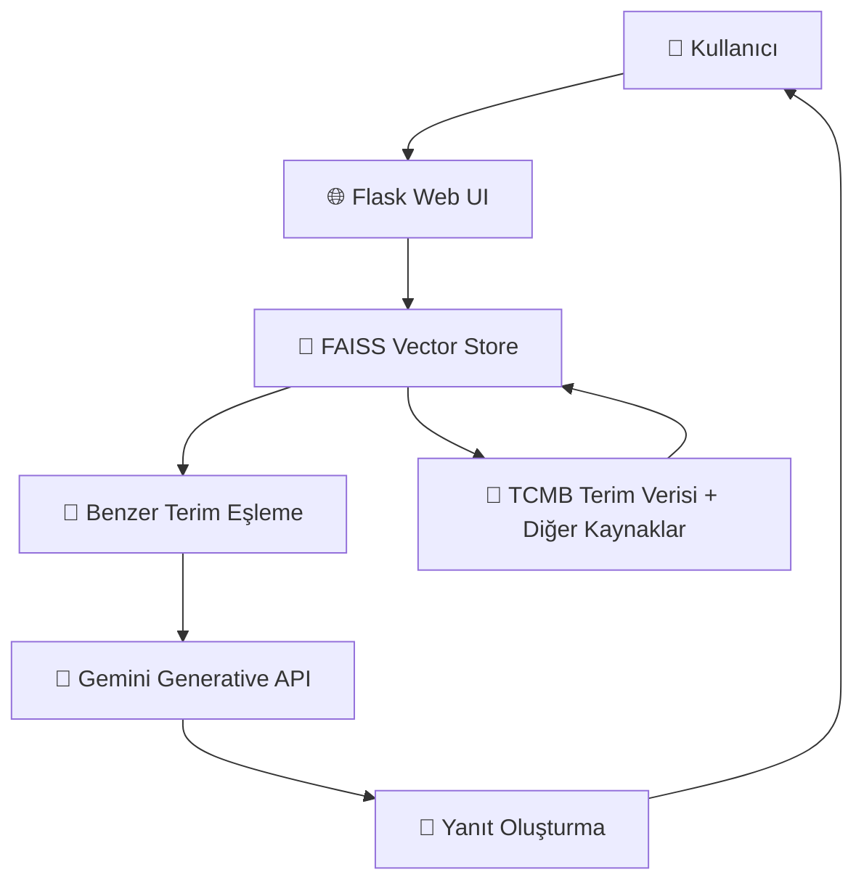

# 💬 Finansal Terimler Chatbot

Bu proje, **finansal terimlerin anlamlarını açıklamak** amacıyla geliştirilmiş bir **RAG (Retrieval-Augmented Generation)** tabanlı chatbot uygulamasıdır.  
Uygulama, **FAISS vektör veritabanı** ve **Google Generative AI (Gemini)** API'sini kullanarak kullanıcılara Türkçe açıklamalar sunar.  
Arayüz, **Flask + HTML/CSS/JS** tabanlı modern bir sohbet ekranı şeklinde tasarlanmıştır.

---

## 🚀 Proje Amacı

Finansal kavramlar (“temettü”, “enflasyon”, “likidite” gibi) çoğu kullanıcı için karmaşık olabilir.  
Bu proje, bu terimleri **doğal dilde açıklayan**, **kaynak tabanlı (RAG)** bir chatbot oluşturarak kullanıcıların finansal okuryazarlığını artırmayı hedefler.  

Uygulama:
- Kullanıcı sorgusunu FAISS vektör veritabanında benzer terimlerle eşleştirir.  
- Eşleşen içerikleri **Gemini modeli** ile birleştirip açıklayıcı ve sade bir cevap üretir.

---

## 🚀 Deploy (Render)

Bu proje, **Render** platformu üzerinden canlıya alınmıştır.  
Uygulama aşağıdaki bağlantı üzerinden erişilebilir:

🔗 **Canlı Proje:** [https://finansal-terimler-chatbot.onrender.com](https://finansal-terimler-chatbot.onrender.com)

Render, Python ortamını otomatik olarak yapılandırır ve `server.py` dosyasını çalıştırarak uygulamayı başlatır.  
Proje güncellendiğinde Render otomatik olarak yeniden deploy işlemini gerçekleştirir.

---


## 📚 Veri Seti

Chatbot’un bilgi tabanı, **Türkçe finansal terimlerden** oluşan özel bir veri setine dayanmaktadır.  
Bu veri seti, hem **TCMB’nin (Türkiye Cumhuriyet Merkez Bankası) Terimler Sözlüğü** sayfasından otomatik olarak çekilen tanımları,  
hem de diğer finansal kaynaklardan (Investopedia, BDDK, çeşitli akademik içerikler vb.) derlenen kavramları içermektedir.

Veri toplama süreci tamamen otomatik hale getirilmiştir.  
**Selenium** ve **BeautifulSoup** kullanılarak TCMB’nin resmî web sitesindeki tüm terimler çekilir,  
temizlenir ve aşağıdaki formatta CSV dosyasına kaydedilir:


**Veri Özeti:**
- Kaynaklar: TCMB, BDDK, Investopedia, sentetik veriler, çeşitli yatırım firmaları  
- Format: CSV  
- Sütunlar: `terim` (term), `tanım` (definition)  
- Kayıt sayısı: ~800+ terim  
- Güncelleme: TCMB terimleri script ile otomatik yenilenebilir  
- Kullanım: FAISS vektör araması ile semantik benzerlik hesaplanır

---

## 🧠 Kullanılan Teknolojiler

| Kategori | Teknoloji / Araç |
|-----------|------------------|
| Yapay Zekâ | Google Gemini API |
| Arama Motoru | FAISS Vector Database |
| Framework | Flask |
| Arayüz | HTML / CSS / JS |
| Veri Toplama | Selenium, BeautifulSoup |
| Çevre Değişkenleri | dotenv |
| Embedding | Google Generative Embeddings |
| Mimarî | Retrieval-Augmented Generation (RAG) |

---

## ⚙️ Kurulum ve Çalıştırma

### 1️⃣ Sanal ortam oluştur (isteğe bağlı)
```bash
python -m venv .venv
.\.venv\Scriptsctivate
```

### 2️⃣ Gereksinimleri yükle
```bash
pip install -r requirements.txt
```

### 3️⃣ `.env` dosyasını oluştur
Proje kök dizinine `.env` dosyası ekleyip içine şu satırı yaz:
```
GOOGLE_API_KEY=your_key_here
```

### 4️⃣ TCMB verilerini çek (isteğe bağlı)
```bash
python terimler.py
```

### 5️⃣ Uygulamayı başlat
```bash
python server.py
```

Uygulama yerel olarak şu adreste çalışır:  
👉 [http://localhost:5000](http://localhost:5000)

---

## 🧩 Çözüm Mimarisi


```mermaid
graph TD
    A[👤 Kullanıcı] --> B[🌐 Flask Web UI]
    B --> C[📁 FAISS Vector Store]
    C --> D[🔎 Benzer Terim Eşleme]
    D --> E[🧠 Gemini Generative API]
    E --> F[💬 Yanıt Oluşturma]
    F --> A
    C --> G[📘 TCMB Terim Verisi + Diğer Kaynaklar]
    G --> C
```

---

## ✨ Geliştirici

**Buğra Kıvrak**  
📍 Fırat Üniversitesi — Yapay Zekâ ve Veri Mühendisliği  
📫 [LinkedIn](https://linkedin.com/in/bugrakivrak16) | [GitHub](https://github.com/bugraq) | [Kaggle](https://www.kaggle.com/burakvrak)
